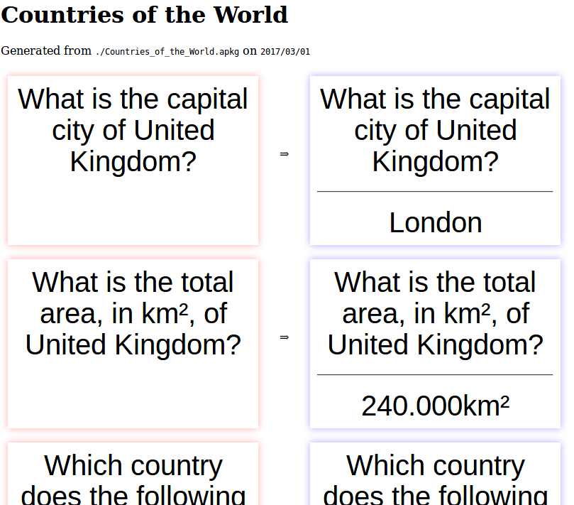

anki2html
=========

Dump Anki2 flashcards to HTML

First, compile the package using the link:https://golang.org/doc/install[golang tool chain]:
____
go build github.com/meisterluk/anki2html
____

Secondly, run the anki2html executable with an APKG file as argument (like the ones at link:http://ankiweb.net/[ankiweb.net]):
____
./anki2html ./Countries_of_the_World.apkg
____

An out folder will be created containing the dump:

cheers,
meisterluk
